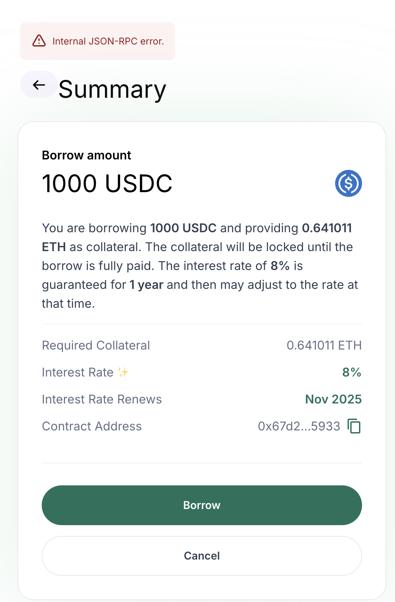

# Shrub Lend

```
Node Version 20
```

## To run locally
```
cp packages/app/dotenv.example packages/app/.env
overmind s
```

In a different terminal:
```
yarn local-initialize
```


To run subgraph locally:
```
yarn subgraph
```

## FAQ
- If you run into this error, try [resetting your metamask account](https://medium.com/@thelasthash/solved-nonce-too-high-error-with-metamask-and-hardhat-adc66f092cd)
<p align="center">
  
</p>
